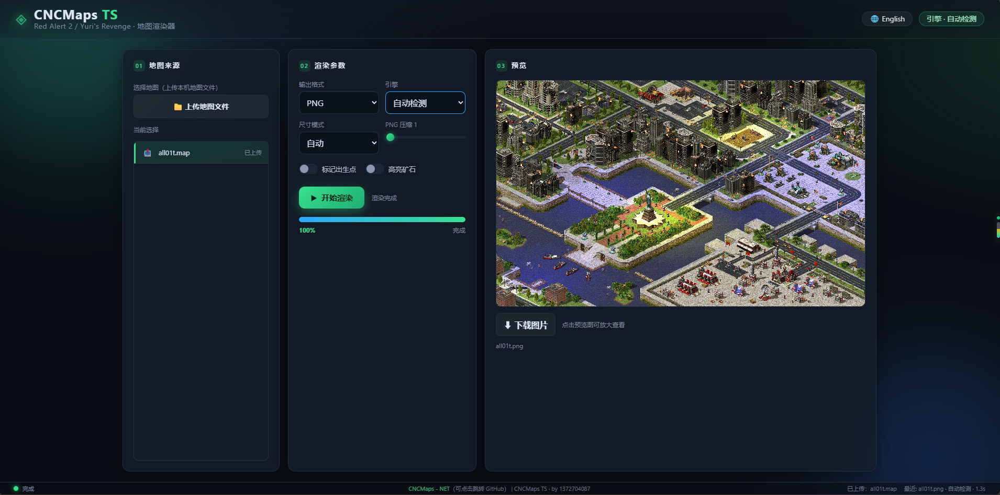

# CNCMaps TS（TypeScript 移植版）

[Red Alert 2 / Yuri's Revenge / Tiberian Sun / Firestorm](http://cncnet.org) 地图渲染器的 TypeScript 移植版。原版为 [ccmaps-net](https://github.com/zzattack/ccmaps-net)（Frank Razenberg / zzattack 使用 C#/.NET 编写），本项目将其移植到 TypeScript / Node.js，并附带一个本地 Web 上传渲染前端。



*完整工作流：上传地图 → 配置渲染参数 → 渲染 → 预览 / 放大查看 / 下载。*

## 功能

- 解析 `.map` / `.yrm` / `.mpr` 地图文件
- 支持引擎：Red Alert 2、Yuri's Revenge、Tiberian Sun、Firestorm（TS/FS 为泰伯利亚之日及其资料片火风暴）
- 从游戏安装目录读取 `.mix`（rules.ini、art.ini、tiles、SHP 动画、VXL 渲染）进行离线渲染
- 渲染选项：
  - 输出格式 PNG / JPG，可自定义缩放尺寸
  - 出生点标记（红色方块）
  - 矿石 / 宝石高亮
  - 光照
  - 强制指定引擎（RA2 / YR / TS / FS / 自动侦测）
- Web 端「上传地图 → 渲染 → 预览 / 放大查看 / 下载」一站式流程：
  - 服务器内置一份游戏文件，客户端只需上传地图文件，无需本地游戏路径
  - NDJSON 流式渲染进度
  - 结果图内存缓存（30 分钟，最多 16 张）

## 快速开始

### 环境要求

- Node.js 16+
- 一份游戏安装目录（含 `*.mix` 文件）：Red Alert 2 / Yuri's Revenge / Tiberian Sun / Firestorm 任一

### 构建

```bash
npm install
npm run build
```

### 命令行渲染（CLI）

```bash
node dist/cli.js \
  --infile="path\to\map.map" \
  --mixdir="path\to\game\dir" \
  --outdir="path\to\output" \
  --output-png \
  --force-yr
```

常用参数：

| 参数 | 说明 |
| ---- | ---- |
| `-i, --infile` | 输入地图文件（必填） |
| `-m, --mixdir` | 游戏目录，渲染所需 `.mix` 文件来源 |
| `-d, --outdir` | 输出目录 |
| `-p, --output-png` | 输出 PNG |
| `-j, --output-jpg` | 输出 JPG |
| `-y, --force-ra2` | 强制 RA2 引擎 |
| `-Y, --force-yr` | 强制 YR 引擎 |
| `-t, --force-ts` | 强制 TS（泰伯利亚之日）引擎 |
| `-T, --force-fs` | 强制 FS（火风暴）引擎 |
| `-S, --start-pos-squared` | 出生点方块标记 |
| `--mark-start-pos` | 启用出生点标记 |
| `-r, --mark-ore` | 矿石 / 宝石高亮 |
| `--progress` | 输出进度信息 |

### Web 服务

```bash
npm run web
```

默认监听 `http://localhost:5173`。在浏览器打开后，点击「上传地图文件」选择一个地图，勾选渲染选项并「开始渲染」，即可预览、放大和下载。

服务端通过环境变量 `CNCMAPS_GAME_DIR` 指定游戏目录（渲染所需的 `.mix` 文件来源）：

```powershell
$env:CNCMAPS_GAME_DIR = 'C:\path\to\game'
npm run web
```

需要同时支持多个游戏数据目录（例如 RA2/YR 与 TS/FS 分装在不同目录）时，用 `CNCMAPS_GAME_DIRS`，多个目录以分号分隔：

```powershell
$env:CNCMAPS_GAME_DIRS = 'C:\RA2;D:\TiberianSun'
npm run web
```

渲染时这些目录都会作为 `.mix` 数据来源参与查找，引擎由地图或界面选项自动决定使用哪套。

其他可选环境变量：

- `CNCMAPS_WEB_PORT`：服务端口（默认 5173）
- `CNCMAPS_WEB_SCRATCH`：渲染临时目录（默认系统临时目录 `cncmaps-render`）
- `CNCMAPS_WEB_UPLOAD`：上传临时目录（默认系统临时目录 `cncmaps-uploads`）

## 版权声明

本项目是 [ccmaps-net](https://github.com/zzattack/ccmaps-net) 的 TypeScript 移植版，最初由 Frank Razenberg 开发。二次创作与重新分发请遵守原始项目许可证。本仓库仅包含源代码，不包含任何受版权保护的游戏资源（`.mix`、SHP、VXL 等），渲染时需要用户自备游戏安装目录。